# CMS — Entity-Relationship Overview

40+ models grouped into seven subsystems. Every public-facing content entity
follows the same five patterns:

1. Canonical row (with default-locale fields inline for fallback)
2. `*Translation` sibling table keyed by `(entityId, locale)`
3. Optional `*Version` snapshot table for revision history
4. Optional `seoId` → `SeoMeta` 1:1 link
5. `deletedAt DateTime?` for soft delete

## Subsystem map

```
┌──────────────────────────────────────────────────────────────────────────────┐
│  1. IDENTITY & AUDIT                                                          │
│     User ─┬─→ creates/updates Page, BlogPost                                  │
│           ├─→ owns Author profile                                             │
│           └─→ assigned to LeadSubmission                                      │
└──────────────────────────────────────────────────────────────────────────────┘
┌──────────────────────────────────────────────────────────────────────────────┐
│  2. PAGE COMPOSITION                                                          │
│     Page ──1:N──→ Section ──┬──1:1──→ HeroSection                             │
│       │                     ├──1:1──→ CtaBlock                                │
│       │                     ├──1:1──→ LeadForm (reuses LeadForm definition)   │
│       │                     ├──N:M──→ Country (SectionCountryCard)            │
│       │                     ├──N:M──→ Testimonial                             │
│       │                     ├──N:M──→ Resource                                │
│       │                     ├──N:M──→ CoursePathway                           │
│       │                     └──N:M──→ Component (SectionComponent)            │
│       │                                                                       │
│       ├──1:N──→ PageTranslation        (i18n)                                 │
│       ├──1:N──→ PageVersion            (revision snapshots)                   │
│       ├──1:1──→ SeoMeta                                                       │
│       └──self──→ Page (parent/children for nested URLs)                       │
└──────────────────────────────────────────────────────────────────────────────┘
┌──────────────────────────────────────────────────────────────────────────────┐
│  3. CONTENT ATOMS — embedded in Sections                                      │
│     HeroSection    ── HeroSectionTranslation                                  │
│     CtaBlock       ── CtaBlockTranslation                                     │
│     Component      ── ComponentTranslation                                    │
│     Country        ── CountryTranslation, has SeoMeta                         │
│     Testimonial    ── TestimonialTranslation, optional → Country              │
│     CoursePathway  ── CoursePathwayTranslation, → Country, has Requirements   │
│     Resource       ── ResourceTranslation, has SeoMeta, → Author              │
└──────────────────────────────────────────────────────────────────────────────┘
┌──────────────────────────────────────────────────────────────────────────────┐
│  4. BLOG                                                                      │
│     BlogPost ── BlogPostTranslation                                           │
│              ── BlogPostVersion                                               │
│              ── SeoMeta                                                       │
│              ── Author ── AuthorTranslation                                   │
│              ── Category (N:M via BlogPostCategory)                           │
│              ── Tag (N:M via BlogPostTag)                                     │
│     Category ── self (parent/children) ── SeoMeta ── CategoryTranslation      │
└──────────────────────────────────────────────────────────────────────────────┘
┌──────────────────────────────────────────────────────────────────────────────┐
│  5. NAVIGATION & FOOTER                                                       │
│     NavMenu ── NavItem ── self (sub-menus) ── NavItemTranslation              │
│             NavItem ── optional Page (auto-track slug renames)                │
│     FooterColumn ── FooterColumnTranslation                                   │
│                  ── FooterLink ── FooterLinkTranslation                       │
│                  FooterLink ── optional Page                                  │
└──────────────────────────────────────────────────────────────────────────────┘
┌──────────────────────────────────────────────────────────────────────────────┐
│  6. LEAD CAPTURE                                                              │
│     LeadForm ── LeadFormField ── LeadFormFieldTranslation                     │
│              ── LeadFormTranslation                                           │
│              ── LeadSubmission ── assignedTo User                             │
│              ── Section[]  (forms reusable across pages)                      │
└──────────────────────────────────────────────────────────────────────────────┘
┌──────────────────────────────────────────────────────────────────────────────┐
│  7. PLATFORM CONFIG                                                           │
│     SiteSetting ── SiteSettingTranslation                                     │
│     SiteTheme    (admin-editable palette + typography)                        │
│     VisaRiskRule ── VisaRiskRuleTranslation (scoped per Country)              │
│     Redirect     (URL aliases / legacy URL forwarding)                        │
│     SeoMeta      (shared by Page, BlogPost, Country, Category, Resource,      │
│                   CoursePathway)                                              │
└──────────────────────────────────────────────────────────────────────────────┘
```

## Mermaid

```mermaid
erDiagram
  User ||--o{ Page : "creates/updates"
  User ||--o| Author : "profile"
  User ||--o{ LeadSubmission : "assigned"

  Page ||--o{ PageTranslation : "i18n"
  Page ||--o{ PageVersion : "versions"
  Page ||--o| SeoMeta : "seo"
  Page ||--o{ Section : "composition"
  Page ||--o{ Page : "parent/children"

  Section ||--o| HeroSection : "typed"
  Section ||--o| CtaBlock : "typed"
  Section }o--o| LeadForm : "typed (form reused)"
  Section ||--o{ SectionCountryCard : "m:n"
  Section ||--o{ SectionTestimonial : "m:n"
  Section ||--o{ SectionResource : "m:n"
  Section ||--o{ SectionCoursePathway : "m:n"
  Section ||--o{ SectionComponent : "m:n"
  Section ||--o{ SectionTranslation : "i18n"

  HeroSection ||--o{ HeroSectionTranslation : "i18n"
  CtaBlock ||--o{ CtaBlockTranslation : "i18n"
  Component ||--o{ ComponentTranslation : "i18n"
  Component ||--o{ SectionComponent : ""

  Country ||--o{ SectionCountryCard : ""
  Country ||--o{ CountryTranslation : "i18n"
  Country ||--o| SeoMeta : "seo"
  Country ||--o{ CoursePathway : ""
  Country ||--o{ VisaRiskRule : ""
  Country ||--o{ Testimonial : ""

  Testimonial ||--o{ TestimonialTranslation : "i18n"
  Testimonial ||--o{ SectionTestimonial : ""

  BlogPost ||--o{ BlogPostTranslation : "i18n"
  BlogPost ||--o{ BlogPostVersion : "versions"
  BlogPost ||--o| SeoMeta : "seo"
  BlogPost }o--o| Author : ""
  BlogPost ||--o{ BlogPostCategory : ""
  BlogPost ||--o{ BlogPostTag : ""

  Category ||--o{ CategoryTranslation : "i18n"
  Category ||--o| SeoMeta : "seo"
  Category ||--o{ Category : "parent/children"
  Category ||--o{ BlogPostCategory : ""

  Author ||--o{ AuthorTranslation : "i18n"
  Author ||--o{ Resource : ""

  Resource ||--o{ ResourceTranslation : "i18n"
  Resource ||--o| SeoMeta : "seo"
  Resource ||--o{ SectionResource : ""

  CoursePathway ||--o{ CoursePathwayTranslation : "i18n"
  CoursePathway ||--o| SeoMeta : "seo"
  CoursePathway ||--o{ PathwayRequirement : ""
  CoursePathway ||--o{ SectionCoursePathway : ""

  VisaRiskRule ||--o{ VisaRiskRuleTranslation : "i18n"

  LeadForm ||--o{ LeadFormField : ""
  LeadForm ||--o{ LeadFormTranslation : "i18n"
  LeadForm ||--o{ LeadSubmission : ""
  LeadFormField ||--o{ LeadFormFieldTranslation : "i18n"

  NavMenu ||--o{ NavItem : ""
  NavItem ||--o{ NavItem : "parent/children"
  NavItem ||--o{ NavItemTranslation : "i18n"
  NavItem }o--o| Page : ""

  FooterColumn ||--o{ FooterLink : ""
  FooterColumn ||--o{ FooterColumnTranslation : "i18n"
  FooterLink ||--o{ FooterLinkTranslation : "i18n"
  FooterLink }o--o| Page : ""

  SeoMeta ||--o{ SeoMetaTranslation : "i18n"
  SiteSetting ||--o{ SiteSettingTranslation : "i18n"
```



## Key relational decisions

### 1. Translation tables, not JSON columns

Every localizable entity has a sibling `*Translation` table with a unique
`(entityId, locale)` constraint. This gives:

- **Indexed text search** — `WHERE locale = 'NE' AND title ILIKE '%MBBS%'` uses
  normal indexes
- **Per-locale slug uniqueness** — `(locale, slug)` is unique so `/ne/programs/x`
  and `/en/programs/x` can coexist for the same canonical entity
- **Incremental locale rollout** — adding `HI`/`ZH` is a row insert, not a
  schema migration

The trade-off is one extra JOIN per request; the data-access layer mitigates
this by only including the requested locale via
`include: { translations: { where: { locale } } }`.

### 2. Canonical fallback fields on the parent row

The parent row carries the default-locale value for high-traffic fields like
`Page.title`, `BlogPost.title`, `NavItem.label`, `FooterColumn.heading`. Public
read paths can render with one query when the requested locale equals the
default; translations only matter when a different locale is requested. This
keeps the hot path fast without giving up the relational i18n model.

### 3. SeoMeta as a shared 1:1

Six entities link to `SeoMeta` via `seoId String? @unique`: `Page`, `BlogPost`,
`Country`, `Category`, `Resource`, `CoursePathway`. Each consumer holds the FK
and exposes a back-reference on `SeoMeta`. This avoids polymorphic anti-patterns
(no `entity_type` column to switch on) while letting all SEO fields evolve in
one place.

### 4. `Section` as a tagged union

`Section.type` is the discriminator. Type-specific data lives in:

- **1:1 relations** for single-instance blocks — `HeroSection`, `CtaBlock`,
  `LeadForm`
- **M:N join tables** for collection blocks — `Country`, `Testimonial`,
  `Resource`, `CoursePathway`, `Component`

Plain text overrides (heading, subheading, body) live on `SectionTranslation`
and are shared across all section types. Layout flags (padding, background,
container width, custom switches) go in the `settings JSON` column on
`Section` — no schema migration needed when the design team adds new variants.

### 5. Versioning via JSON snapshots

`PageVersion` and `BlogPostVersion` store the entire serialized state at the
moment of save. Much simpler than diff-based versioning and lets the admin
"restore" a version with a single write. Snapshots also survive schema
migrations — old versions stay readable when new fields are added.

### 6. Slug uniqueness scope

| Entity        | Unique scope                                                |
| ------------- | ----------------------------------------------------------- |
| Page          | global on canonical slug; `(parentId, slug)` for nested URLs |
| BlogPost      | global on canonical slug; `(locale, slug)` on translations  |
| Country       | global                                                      |
| Category      | global; hierarchy via `parentId`                            |
| Resource      | global                                                      |
| CoursePathway | global                                                      |
| Tag           | global                                                      |
| Author        | global                                                      |
| Redirect      | global on `fromPath`                                        |

`Redirect.fromPath` is also globally unique — required so slug renames can be
captured automatically without 404s.

### 7. Optional Page linkage on nav/footer items

`NavItem.pageId` and `FooterLink.pageId` are optional FKs. When set, the
public renderer resolves the URL from the linked page — slug renames stay
live without admin intervention. When null, the `url` text field is used
verbatim (for external links).

### 8. Soft delete

Every content entity carries `deletedAt DateTime?`. All admin/public read
queries filter on `deletedAt: null`. The schema does **not** enforce this
with a global filter (Prisma has no first-class support yet) — it's enforced
at the data-access layer. Indexes on `deletedAt` keep filtered scans fast.

### 9. Audit columns

`User` is referenced by content entities through `createdById` / `updatedById`
for editorial accountability. Foreign keys use `onDelete: SetNull` so removing
a user doesn't cascade-delete their pages.
